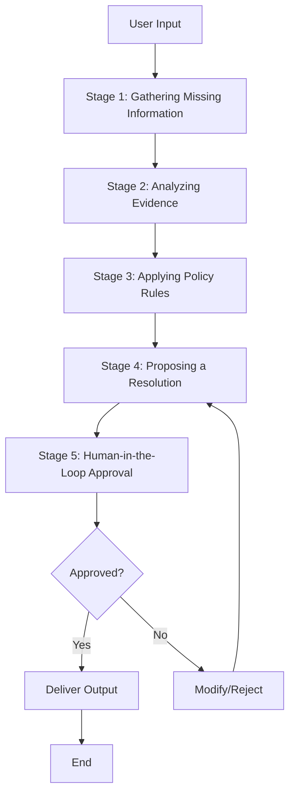

# Design Document: Medical Health Review System

## Overview

The Medical Health Review System is a single-agent workflow application that analyzes medical reports and health data to provide trend analysis, risk detection, and personalized health guidance. The system operates through five sequential stages: Gathering Missing Information, Analyzing Evidence, Applying Policy Rules, Proposing a Resolution, and Human-in-the-Loop Approval.

The design emphasizes medical safety by implementing strict constraints against prescriptive medical advice, requiring human approval for high-risk findings, and maintaining clear boundaries around what the system can and cannot do. The system supports multiple user roles (Patient, Caregiver, Doctor, Lab Admin) with appropriate access controls and provides multi-language support for health summaries.

## Architecture

### High-Level Architecture

The system follows a single-agent workflow pattern with five distinct stages:



### System Components

1. **Workflow Orchestrator**: Manages the five-stage workflow, maintains state, and coordinates transitions between stages
2. **Data Ingestion Module**: Handles PDF uploads, manual data entry, and data validation
3. **Parameter Extraction Engine**: Extracts health parameters from medical reports using PDF parsing and pattern recognition
4. **Trend Analysis Engine**: Performs time-series analysis, anomaly detection, and risk pattern identification
5. **Policy Engine**: Enforces medical safety constraints, consent verification, and escalation rules
6. **Resolution Generator**: Creates visualizations, summaries, lifestyle suggestions, and next-step recommendations
7. **Translation Service**: Provides multi-language support for health summaries
8. **Approval Interface**: Presents findings to human reviewers and captures approval decisions
9. **Access Control Manager**: Enforces role-based permissions and audit logging
10. **Data Store**: Persists medical reports, extracted parameters, trends, and audit trails

### Technology Considerations

- **PDF Processing**: Use a robust PDF parsing library capable of handling various medical report formats
- **Data Storage**: Secure, encrypted storage for sensitive health data with backup and recovery
- **Translation**: Integration with translation APIs or local language models for Hindi, Tamil, and other regional languages
- **Visualization**: Charting library for time-series graphs with customizable styling
- **Authentication**: Secure user authentication with role-based access control
- **Audit Logging**: Comprehensive logging of all data access, modifications, and approval decisions

## Components and Interfaces

### 1. Workflow Orchestrator

**Responsibility**: Coordinates the five-stage workflow and manages state transitions.

**Interface**:
```
WorkflowOrchestrator:
  - start_workflow(user_id, input_data) -> workflow_id
  - get_workflow_state(workflow_id) -> WorkflowState
  - resume_workflow(workflow_id) -> void
  - abort_workflow(workflow_id) -> void
```

**Key Operations**:
- Initialize workflow with user input
- Transition between stages based on completion status
- Handle interruptions and allow resumption
- Maintain workflow state persistence

### 2. Data Ingestion Module

**Responsibility**: Accept and validate medical reports and manual health readings.

**Interface**:
```
DataIngestionModule:
  - upload_report(user_id, pdf_file, metadata) -> report_id
  - add_glucometer_reading(user_id, value, timestamp, unit) -> reading_id
  - validate_report(report_id) -> ValidationResult
  - check_data_completeness(user_id) -> CompletenessReport
```

**Key Operations**:
- Accept PDF files and validate file integrity
- Parse and validate manually entered readings
- Check for missing patient context
- Reject corrupted or invalid files with descriptive errors

### 3. Parameter Extraction Engine

**Responsibility**: Extract health parameters from medical reports.

**Interface**:
```
ParameterExtractionEngine:
  - extract_parameters(report_id) -> List<HealthParameter>
  - validate_extracted_values(parameters) -> ValidationResult
  - flag_uncertain_extractions(parameters) -> List<HealthParameter>
  - associate_timestamps(parameters, report_date) -> List<TimestampedParameter>
```

**Key Operations**:
- Parse PDF content to identify health parameters
- Extract values for HbA1c, liver markers, kidney function, thyroid levels, etc.
- Validate extracted values are within plausible ranges
- Flag parameters that cannot be extracted with confidence
- Preserve original units of measurement

### 4. Trend Analysis Engine

**Responsibility**: Analyze health parameters over time to identify trends and risks.

**Interface**:
```
TrendAnalysisEngine:
  - calculate_trend(parameter_name, data_points) -> Trend
  - detect_risk_patterns(parameters, history) -> List<RiskFlag>
  - compare_to_normal_ranges(parameter, patient_context) -> ComparisonResult
  - identify_anomalies(parameters) -> List<Anomaly>
  - find_correlations(parameters) -> List<Correlation>
```

**Key Operations**:
- Calculate trend direction (increasing, decreasing, stable) for parameters with 2+ data points
- Generate risk flags for concerning trends across 3+ time periods
- Account for age, gender, and patient-specific baselines
- Highlight anomalies in health parameters
- Identify correlations between multiple parameters

### 5. Policy Engine

**Responsibility**: Enforce medical safety constraints and escalation rules.

**Interface**:
```
PolicyEngine:
  - check_safety_constraints(proposed_output) -> PolicyCheckResult
  - verify_consent(user_id, operation) -> bool
  - evaluate_risk_level(findings) -> RiskLevel
  - require_human_approval(findings) -> bool
  - check_medication_interactions(medication_list) -> List<Interaction>
```

**Key Operations**:
- Prevent generation of prescriptions or diagnoses
- Require human approval for high-risk findings
- Verify user consent before processing
- Limit medication information to non-prescriptive reminders
- Flag critical parameters for immediate human review

### 6. Resolution Generator

**Responsibility**: Create visualizations, summaries, and recommendations.

**Interface**:
```
ResolutionGenerator:
  - generate_trend_charts(parameters) -> List<Chart>
  - create_risk_summary(risk_flags) -> Summary
  - generate_lifestyle_suggestions(trends, patient_context) -> List<Suggestion>
  - create_medication_reminders(interactions) -> List<Reminder>
  - generate_next_steps(findings, risk_level) -> List<Action>
```

**Key Operations**:
- Create time-series charts with normal ranges and risk thresholds
- Generate risk flags with visual indicators
- Provide evidence-based lifestyle suggestions
- Create non-prescriptive medication interaction reminders
- Suggest prioritized next steps (e.g., "Book doctor appointment")

### 7. Translation Service

**Responsibility**: Translate health summaries into regional languages.

**Interface**:
```
TranslationService:
  - translate_summary(summary, target_language) -> TranslatedSummary
  - get_supported_languages() -> List<Language>
  - translate_medical_term(term, target_language) -> TranslatedTerm
  - handle_untranslatable_term(term, target_language) -> string
```

**Key Operations**:
- Translate summaries into English, Hindi, Tamil, and other languages
- Maintain accuracy and use culturally appropriate terminology
- Provide English terms with transliteration when translation unavailable
- Allow users to switch languages and regenerate summaries

### 8. Approval Interface

**Responsibility**: Present findings to human reviewers and capture decisions.

**Interface**:
```
ApprovalInterface:
  - present_for_approval(findings, reviewer_id) -> approval_request_id
  - get_approval_status(approval_request_id) -> ApprovalStatus
  - approve_output(approval_request_id, reviewer_id) -> void
  - reject_output(approval_request_id, reviewer_id, reason) -> void
  - modify_and_approve(approval_request_id, reviewer_id, modifications) -> void
```

**Key Operations**:
- Present high-risk findings for human review
- Allow reviewers to approve, reject, or modify outputs
- Maintain audit trail of approval decisions
- Prevent communication of rejected outputs

### 9. Access Control Manager

**Responsibility**: Enforce role-based permissions and audit logging.

**Interface**:
```
AccessControlManager:
  - authenticate_user(credentials) -> User
  - check_permission(user_id, resource, operation) -> bool
  - grant_access(patient_id, grantee_id, role) -> void
  - revoke_access(patient_id, grantee_id) -> void
  - log_access(user_id, resource, operation, timestamp) -> void
```

**Key Operations**:
- Support Patient, Caregiver, Doctor, and Lab_Admin roles
- Verify permissions before allowing data access
- Allow patients to grant/revoke access to caregivers and doctors
- Log all data access for audit purposes
- Enforce that only patients or authorized caregivers can modify data

### 10. Data Store

**Responsibility**: Persist all system data securely.

**Interface**:
```
DataStore:
  - store_report(report) -> report_id
  - store_parameter(parameter) -> parameter_id
  - store_trend(trend) -> trend_id
  - store_audit_log(log_entry) -> log_id
  - query_parameters(user_id, parameter_name, date_range) -> List<Parameter>
  - query_trends(user_id, parameter_name) -> List<Trend>
```

**Key Operations**:
- Store medical reports, extracted parameters, and trends
- Maintain audit trails with timestamps
- Support efficient querying by user, parameter, and date range
- Implement encryption for sensitive health data
- Provide backup and recovery mechanisms

## Data Models

### HealthParameter

Represents a single health metric extracted from a report or manually entered.

```
HealthParameter:
  - parameter_id: string
  - user_id: string
  - parameter_name: string (e.g., "HbA1c", "ALT", "Creatinine")
  - value: float
  - unit: string (e.g., "%", "U/L", "mg/dL")
  - timestamp: datetime
  - source: string ("report" | "manual")
  - report_id: string (optional, if from report)
  - confidence: float (0.0-1.0, for extracted parameters)
```

### MedicalReport

Represents an uploaded medical report.

```
MedicalReport:
  - report_id: string
  - user_id: string
  - upload_timestamp: datetime
  - report_date: datetime
  - file_path: string
  - lab_name: string
  - patient_id_on_report: string
  - validation_status: string ("valid" | "invalid" | "pending_review")
  - validation_errors: List<string>
```

### Trend

Represents a calculated trend for a health parameter.

```
Trend:
  - trend_id: string
  - user_id: string
  - parameter_name: string
  - direction: string ("increasing" | "decreasing" | "stable")
  - data_points: List<HealthParameter>
  - start_date: datetime
  - end_date: datetime
  - slope: float (rate of change)
  - confidence: float (0.0-1.0)
```

### RiskFlag

Represents an identified health risk.

```
RiskFlag:
  - risk_id: string
  - user_id: string
  - parameter_name: string
  - risk_level: string ("low" | "medium" | "high" | "critical")
  - description: string
  - trend_id: string
  - detected_at: datetime
  - requires_human_approval: bool
```

### WorkflowState

Represents the current state of a workflow execution.

```
WorkflowState:
  - workflow_id: string
  - user_id: string
  - current_stage: int (1-5)
  - stage_status: string ("in_progress" | "completed" | "paused" | "failed")
  - input_data: object
  - stage_outputs: Map<int, object>
  - created_at: datetime
  - updated_at: datetime
```

### ApprovalRequest

Represents a request for human approval.

```
ApprovalRequest:
  - approval_request_id: string
  - workflow_id: string
  - findings: object (risk flags, summaries, recommendations)
  - reviewer_id: string
  - status: string ("pending" | "approved" | "rejected" | "modified")
  - decision_timestamp: datetime
  - modifications: object (optional)
  - rejection_reason: string (optional)
```

### User

Represents a system user.

```
User:
  - user_id: string
  - email: string
  - role: string ("patient" | "caregiver" | "doctor" | "lab_admin")
  - preferred_language: string
  - consent_status: bool
  - consent_timestamp: datetime
  - created_at: datetime
```

### AccessGrant

Represents permission granted by a patient to another user.

```
AccessGrant:
  - grant_id: string
  - patient_id: string
  - grantee_id: string
  - granted_role: string ("caregiver" | "doctor")
  - granted_at: datetime
  - revoked_at: datetime (optional)
  - is_active: bool
```

### AuditLog

Represents an audit trail entry.

```
AuditLog:
  - log_id: string
  - user_id: string
  - action: string
  - resource_type: string
  - resource_id: string
  - timestamp: datetime
  - ip_address: string
  - details: object
```
