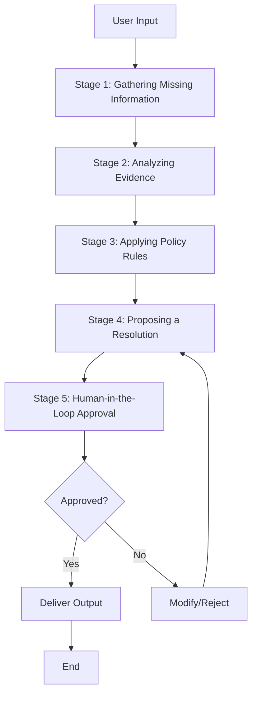
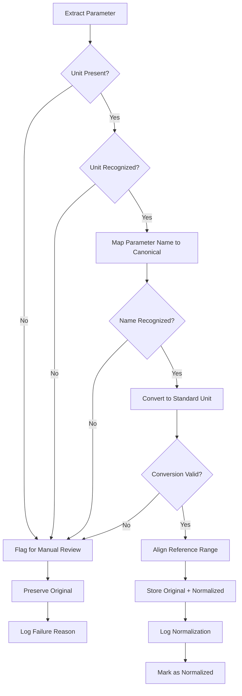

# Design Document: Medical Health Review System

## Overview

The Medical Health Review System is a single-agent workflow application that analyzes medical reports and health data to provide trend analysis, risk detection, and personalized health guidance. The system operates through five sequential stages: Gathering Missing Information, Analyzing Evidence, Applying Policy Rules, Proposing a Resolution, and Human-in-the-Loop Approval.

The design emphasizes medical safety by implementing strict constraints against prescriptive medical advice, requiring human approval for high-risk findings, and maintaining clear boundaries around what the system can and cannot do. The system supports multiple user roles (Patient, Caregiver, Doctor, Lab Admin) with appropriate access controls and provides multi-language support for health summaries.

## Architecture

### High-Level Architecture

The system follows a single-agent workflow pattern with five distinct stages:


```mermaid
graph TD
    A[User Input] --> B[Stage 1: Gathering Missing Information]
    B --> C[Stage 2: Analyzing Evidence]
    C --> D[Stage 3: Applying Policy Rules]
    D --> E[Stage 4: Proposing a Resolution]
    E --> F[Stage 5: Human-in-the-Loop Approval]
    F --> G{Approved?}
    G -->|Yes| H[Deliver Output]
    G -->|No| I[Modify/Reject]
    I --> E
    H --> J[End]
```

### System Components

1. **Workflow Orchestrator**: Manages the five-stage workflow, maintains state, and coordinates transitions between stages
2. **Data Ingestion Module**: Handles PDF uploads, manual data entry, and data validation
3. **Parameter Extraction Engine**: Extracts health parameters from medical reports using PDF parsing and pattern recognition
4. **Data Normalization Service**: Converts extracted parameters to standard units, canonical names, and aligned reference ranges
5. **Trend Analysis Engine**: Performs time-series analysis, anomaly detection, and risk pattern identification
6. **Policy Engine**: Enforces medical safety constraints, consent verification, and escalation rules
7. **Resolution Generator**: Creates visualizations, summaries, lifestyle suggestions, and next-step recommendations
8. **Translation Service**: Provides multi-language support for health summaries
9. **Approval Interface**: Presents findings to human reviewers and captures approval decisions
10. **Access Control Manager**: Enforces role-based permissions and audit logging
11. **Data Store**: Persists medical reports, extracted parameters, trends, and audit trails

### Technology Considerations

- **PDF Processing**: Use a robust PDF parsing library capable of handling various medical report formats
- **Database**: PostgreSQL 15+ for reliable, ACID-compliant data persistence with support for JSON fields, full-text search, and advanced indexing
- **Database Connection**: SQLAlchemy ORM for Python with connection pooling (pool size: 5-20 connections)
- **Database Migrations**: Alembic for version-controlled schema migrations
- **Docker**: Docker Compose for local development environment with PostgreSQL container
- **Data Encryption**: PostgreSQL pgcrypto extension for field-level encryption of sensitive health data
- **Translation**: Integration with translation APIs or local language models for Hindi, Tamil, and other regional languages
- **Visualization**: Charting library for time-series graphs with customizable styling
- **Authentication**: Secure user authentication with role-based access control
- **Audit Logging**: Comprehensive logging of all data access, modifications, and approval decisions

## Components and Interfaces

### 1. Workflow Orchestrator

**Responsibility**: Coordinates the five-stage workflow and manages state transitions.

**Interface**:
```
WorkflowOrchestrator:
  - start_workflow(user_id, input_data) -> workflow_id
  - get_workflow_state(workflow_id) -> WorkflowState
  - resume_workflow(workflow_id) -> void
  - abort_workflow(workflow_id) -> void
```

**Key Operations**:
- Initialize workflow with user input
- Transition between stages based on completion status
- Handle interruptions and allow resumption
- Maintain workflow state persistence

### 2. Data Ingestion Module

**Responsibility**: Accept and validate medical reports and manual health readings.

**Interface**:
```
DataIngestionModule:
  - upload_report(user_id, pdf_file, metadata) -> report_id
  - add_glucometer_reading(user_id, value, timestamp, unit) -> reading_id
  - validate_report(report_id) -> ValidationResult
  - check_data_completeness(user_id) -> CompletenessReport
```

**Key Operations**:
- Accept PDF files and validate file integrity
- Parse and validate manually entered readings
- Check for missing patient context
- Reject corrupted or invalid files with descriptive errors

### 3. Parameter Extraction Engine

**Responsibility**: Extract health parameters from medical reports.

**Interface**:
```
ParameterExtractionEngine:
  - extract_parameters(report_id) -> List<HealthParameter>
  - validate_extracted_values(parameters) -> ValidationResult
  - flag_uncertain_extractions(parameters) -> List<HealthParameter>
  - associate_timestamps(parameters, report_date) -> List<TimestampedParameter>
```

**Key Operations**:
- Parse PDF content to identify health parameters
- Extract values for HbA1c, liver markers, kidney function, thyroid levels, etc.
- Validate extracted values are within plausible ranges
- Flag parameters that cannot be extracted with confidence
- Preserve original units of measurement

### 4. Data Normalization Service

**Responsibility**: Normalize extracted health parameters to standard units, canonical names, and aligned reference ranges.

**Interface**:
```
DataNormalizationService:
  - normalize_parameter(parameter) -> NormalizedParameter
  - convert_unit(value, from_unit, to_unit, parameter_type) -> ConversionResult
  - map_to_canonical_name(parameter_name) -> string
  - align_reference_range(range, parameter_type, lab_source) -> StandardReferenceRange
  - validate_normalization(original, normalized) -> ValidationResult
  - get_conversion_factor(from_unit, to_unit, parameter_type) -> float
```

**Key Operations**:
- **Unit Standardization**: Convert non-standard units to standard units for each parameter type
  - Example: Convert glucose from mg/dL to mmol/L (factor: 0.0555)
  - Example: Standardize liver enzyme units (U/L, IU/L) to consistent format
  - Example: Convert cholesterol from mg/dL to mmol/L (factor: 0.0259)
  
- **Parameter Name Mapping**: Map variant names to canonical names
  - Example: "HbA1c", "Hemoglobin A1c", "Glycated Hemoglobin" → "HbA1c"
  - Example: "ALT", "SGPT", "Alanine Aminotransferase" → "ALT"
  - Example: "Creatinine", "Serum Creatinine", "S.Creatinine" → "Creatinine"
  
- **Reference Range Alignment**: Normalize different lab reference ranges to standard baselines
  - Account for age and gender-specific ranges
  - Convert lab-specific ranges to standardized clinical thresholds
  - Maintain mapping of original lab ranges for audit purposes
  
- **Ambiguity Handling**: Flag parameters with missing or ambiguous units
  - Detect when unit is missing from extracted data
  - Identify ambiguous units that could have multiple interpretations
  - Prevent automatic normalization when confidence is low
  
- **Dual Value Preservation**: Store both original and normalized values
  - Maintain original extracted value with original unit
  - Store normalized value with standard unit
  - Record conversion factor and normalization timestamp
  
- **Audit Trail**: Log all normalization operations
  - Record original value, unit, and source
  - Record normalized value, standard unit, and conversion factor
  - Timestamp each normalization operation
  - Track normalization failures and reasons

**Normalization Rules**:

The service maintains a configuration of normalization rules including:

1. **Unit Conversion Table**: Maps parameter types to supported unit conversions
   ```
   Glucose: mg/dL ↔ mmol/L (factor: 0.0555)
   Cholesterol: mg/dL ↔ mmol/L (factor: 0.0259)
   Creatinine: mg/dL ↔ μmol/L (factor: 88.4)
   Hemoglobin: g/dL ↔ g/L (factor: 10)
   ```

2. **Parameter Name Dictionary**: Maps variant names to canonical names
   ```
   HbA1c: ["HbA1c", "Hemoglobin A1c", "Glycated Hemoglobin", "A1C"]
   ALT: ["ALT", "SGPT", "Alanine Aminotransferase", "Alanine Transaminase"]
   AST: ["AST", "SGOT", "Aspartate Aminotransferase", "Aspartate Transaminase"]
   TSH: ["TSH", "Thyroid Stimulating Hormone", "Thyrotropin"]
   ```

3. **Standard Reference Ranges**: Defines clinical thresholds for each parameter
   ```
   HbA1c: Normal <5.7%, Prediabetes 5.7-6.4%, Diabetes ≥6.5%
   Glucose (fasting): Normal 70-100 mg/dL, Prediabetes 100-125 mg/dL, Diabetes ≥126 mg/dL
   ALT: Normal 7-56 U/L (varies by age/gender)
   Creatinine: Normal 0.7-1.3 mg/dL (varies by age/gender)
   ```

**Error Handling**:
- Unknown parameter names: Preserve original, flag for manual review
- Unknown units: Preserve original, flag for manual review
- Invalid conversion (e.g., negative result): Reject normalization, flag error
- Missing units: Preserve original, flag for manual review
- Ambiguous units: Preserve original, flag for manual review

### 5. Trend Analysis Engine

**Responsibility**: Analyze health parameters over time to identify trends and risks.

**Interface**:
```
TrendAnalysisEngine:
  - calculate_trend(parameter_name, data_points) -> Trend
  - detect_risk_patterns(parameters, history) -> List<RiskFlag>
  - compare_to_normal_ranges(parameter, patient_context) -> ComparisonResult
  - identify_anomalies(parameters) -> List<Anomaly>
  - find_correlations(parameters) -> List<Correlation>
```

**Key Operations**:
- Calculate trend direction (increasing, decreasing, stable) for parameters with 2+ data points
- Use normalized values for trend calculations to ensure accurate comparisons across different labs
- Generate risk flags for concerning trends across 3+ time periods
- Account for age, gender, and patient-specific baselines
- Highlight anomalies in health parameters
- Identify correlations between multiple parameters

### 6. Policy Engine

**Responsibility**: Enforce medical safety constraints and escalation rules.

**Interface**:
```
PolicyEngine:
  - check_safety_constraints(proposed_output) -> PolicyCheckResult
  - verify_consent(user_id, operation) -> bool
  - evaluate_risk_level(findings) -> RiskLevel
  - require_human_approval(findings) -> bool
  - check_medication_interactions(medication_list) -> List<Interaction>
```

**Key Operations**:
- Prevent generation of prescriptions or diagnoses
- Require human approval for high-risk findings
- Verify user consent before processing
- Limit medication information to non-prescriptive reminders
- Flag critical parameters for immediate human review

### 7. Resolution Generator

**Responsibility**: Create visualizations, summaries, and recommendations.

**Interface**:
```
ResolutionGenerator:
  - generate_trend_charts(parameters) -> List<Chart>
  - create_risk_summary(risk_flags) -> Summary
  - generate_lifestyle_suggestions(trends, patient_context) -> List<Suggestion>
  - create_medication_reminders(interactions) -> List<Reminder>
  - generate_next_steps(findings, risk_level) -> List<Action>
```

**Key Operations**:
- Create time-series charts with normal ranges and risk thresholds
- Generate risk flags with visual indicators
- Provide evidence-based lifestyle suggestions
- Create non-prescriptive medication interaction reminders
- Suggest prioritized next steps (e.g., "Book doctor appointment")

### 8. Translation Service

**Responsibility**: Translate health summaries into regional languages.

**Interface**:
```
TranslationService:
  - translate_summary(summary, target_language) -> TranslatedSummary
  - get_supported_languages() -> List<Language>
  - translate_medical_term(term, target_language) -> TranslatedTerm
  - handle_untranslatable_term(term, target_language) -> string
```

**Key Operations**:
- Translate summaries into English, Hindi, Tamil, and other languages
- Maintain accuracy and use culturally appropriate terminology
- Provide English terms with transliteration when translation unavailable
- Allow users to switch languages and regenerate summaries

### 9. Approval Interface

**Responsibility**: Present findings to human reviewers and capture decisions.

**Interface**:
```
ApprovalInterface:
  - present_for_approval(findings, reviewer_id) -> approval_request_id
  - get_approval_status(approval_request_id) -> ApprovalStatus
  - approve_output(approval_request_id, reviewer_id) -> void
  - reject_output(approval_request_id, reviewer_id, reason) -> void
  - modify_and_approve(approval_request_id, reviewer_id, modifications) -> void
```

**Key Operations**:
- Present high-risk findings for human review
- Allow reviewers to approve, reject, or modify outputs
- Maintain audit trail of approval decisions
- Prevent communication of rejected outputs

### 10. Access Control Manager

**Responsibility**: Enforce role-based permissions and audit logging.

**Interface**:
```
AccessControlManager:
  - authenticate_user(credentials) -> User
  - check_permission(user_id, resource, operation) -> bool
  - grant_access(patient_id, grantee_id, role) -> void
  - revoke_access(patient_id, grantee_id) -> void
  - log_access(user_id, resource, operation, timestamp) -> void
```

**Key Operations**:
- Support Patient, Caregiver, Doctor, and Lab_Admin roles
- Verify permissions before allowing data access
- Allow patients to grant/revoke access to caregivers and doctors
- Log all data access for audit purposes
- Enforce that only patients or authorized caregivers can modify data

### 11. Data Store (PostgreSQL)

**Responsibility**: Persist all system data securely in PostgreSQL database.

**Interface**:
```
DataStore:
  - store_report(report) -> report_id
  - store_parameter(parameter) -> parameter_id
  - store_normalized_parameter(normalized_parameter) -> normalized_parameter_id
  - store_trend(trend) -> trend_id
  - store_audit_log(log_entry) -> log_id
  - query_parameters(user_id, parameter_name, date_range) -> List<Parameter>
  - query_normalized_parameters(user_id, canonical_name, date_range) -> List<NormalizedParameter>
  - query_trends(user_id, parameter_name) -> List<Trend>
```

**Key Operations**:
- Store medical reports, extracted parameters, normalized parameters, and trends
- Maintain audit trails with timestamps
- Support efficient querying by user, parameter, and date range
- Implement encryption for sensitive health data using pgcrypto
- Provide backup and recovery mechanisms
- Use connection pooling for performance optimization
- Enforce referential integrity with foreign key constraints

**Database Schema Design**:

The PostgreSQL database will use the following table structure:

1. **users** table
   - Primary key: user_id (UUID)
   - Indexes: email (unique), role
   - Encrypted fields: email (using pgcrypto)

2. **medical_reports** table
   - Primary key: report_id (UUID)
   - Foreign key: user_id references users(user_id)
   - Indexes: user_id, report_date, upload_timestamp
   - Encrypted fields: patient_id_on_report

3. **health_parameters** table
   - Primary key: parameter_id (UUID)
   - Foreign keys: user_id references users(user_id), report_id references medical_reports(report_id)
   - Indexes: user_id, parameter_name, timestamp, normalization_status
   - Composite index: (user_id, parameter_name, timestamp) for trend queries

4. **normalized_parameters** table
   - Primary key: normalized_parameter_id (UUID)
   - Foreign keys: original_parameter_id references health_parameters(parameter_id), user_id references users(user_id)
   - Indexes: user_id, canonical_name, normalized_at
   - Composite index: (user_id, canonical_name, normalized_at) for trend queries

5. **normalization_audit_logs** table
   - Primary key: audit_id (UUID)
   - Foreign keys: parameter_id references health_parameters(parameter_id), normalized_parameter_id references normalized_parameters(normalized_parameter_id)
   - Indexes: parameter_id, timestamp, status

6. **trends** table
   - Primary key: trend_id (UUID)
   - Foreign key: user_id references users(user_id)
   - Indexes: user_id, parameter_name, start_date, end_date

7. **risk_flags** table
   - Primary key: risk_id (UUID)
   - Foreign keys: user_id references users(user_id), trend_id references trends(trend_id)
   - Indexes: user_id, risk_level, detected_at

8. **workflow_states** table
   - Primary key: workflow_id (UUID)
   - Foreign key: user_id references users(user_id)
   - Indexes: user_id, current_stage, stage_status, updated_at

9. **approval_requests** table
   - Primary key: approval_request_id (UUID)
   - Foreign keys: workflow_id references workflow_states(workflow_id), reviewer_id references users(user_id)
   - Indexes: workflow_id, reviewer_id, status

10. **access_grants** table
    - Primary key: grant_id (UUID)
    - Foreign keys: patient_id references users(user_id), grantee_id references users(user_id)
    - Indexes: patient_id, grantee_id, is_active
    - Composite index: (patient_id, grantee_id, is_active)

11. **audit_logs** table
    - Primary key: log_id (UUID)
    - Foreign key: user_id references users(user_id)
    - Indexes: user_id, action, resource_type, timestamp
    - Partitioned by timestamp (monthly partitions) for performance

**Connection Management**:
- Use SQLAlchemy connection pooling with pool_size=10, max_overflow=20
- Connection timeout: 30 seconds
- Pool recycle: 3600 seconds (1 hour) to prevent stale connections
- Echo SQL queries in development mode for debugging

**Migration Strategy**:
- Use Alembic for database migrations
- Version all schema changes
- Support both upgrade and downgrade migrations
- Test migrations on staging before production
- Maintain migration history in alembic_version table

## Docker Development Environment

### Docker Compose Configuration

The system uses Docker Compose to provide a consistent local development environment with PostgreSQL.

**docker-compose.yml structure**:

```yaml
version: '3.8'

services:
  postgres:
    image: postgres:15-alpine
    container_name: medical-health-review-db
    environment:
      POSTGRES_DB: ${DB_NAME:-medical_health_db}
      POSTGRES_USER: ${DB_USER:-medical_user}
      POSTGRES_PASSWORD: ${DB_PASSWORD:-changeme}
      POSTGRES_INITDB_ARGS: "-E UTF8"
    ports:
      - "${DB_PORT:-5432}:5432"
    volumes:
      - postgres_data:/var/lib/postgresql/data
      - ./database/init:/docker-entrypoint-initdb.d
    healthcheck:
      test: ["CMD-SHELL", "pg_isready -U ${DB_USER:-medical_user}"]
      interval: 10s
      timeout: 5s
      retries: 5
    restart: unless-stopped

volumes:
  postgres_data:
    driver: local
```

**Environment Configuration**:

The system uses a `.env` file for configuration:

```
# Database Configuration
DB_NAME=medical_health_db
DB_USER=medical_user
DB_PASSWORD=secure_password_here
DB_HOST=localhost
DB_PORT=5432

# Connection Pool Configuration
DB_POOL_SIZE=10
DB_MAX_OVERFLOW=20
DB_POOL_TIMEOUT=30
DB_POOL_RECYCLE=3600

# Encryption Configuration
DB_ENCRYPTION_KEY=your_encryption_key_here
```

**Initialization Scripts**:

The `database/init/` directory contains SQL scripts that run when the container first starts:

1. `01_create_extensions.sql`: Creates required PostgreSQL extensions (pgcrypto, uuid-ossp)
2. `02_create_schema.sql`: Creates initial database schema (optional, Alembic migrations preferred)

**Development Workflow**:

1. Start PostgreSQL: `docker-compose up -d`
2. Check health: `docker-compose ps`
3. Run migrations: `alembic upgrade head`
4. Stop PostgreSQL: `docker-compose down`
5. Reset database: `docker-compose down -v` (removes volumes)

**Backup and Recovery**:

- **Backup**: `docker-compose exec postgres pg_dump -U medical_user medical_health_db > backup.sql`
- **Restore**: `docker-compose exec -T postgres psql -U medical_user medical_health_db < backup.sql`
- **Automated backups**: Use cron job or scheduled task to run backups daily

## Data Models

### HealthParameter

Represents a single health metric extracted from a report or manually entered.

```
HealthParameter:
  - parameter_id: string
  - user_id: string
  - parameter_name: string (e.g., "HbA1c", "ALT", "Creatinine")
  - value: float
  - unit: string (e.g., "%", "U/L", "mg/dL")
  - timestamp: datetime
  - source: string ("report" | "manual")
  - report_id: string (optional, if from report)
  - confidence: float (0.0-1.0, for extracted parameters)
  - normalization_status: string ("pending" | "normalized" | "failed" | "flagged")
```

### NormalizedParameter

Represents a health parameter after normalization to standard units and naming.

```
NormalizedParameter:
  - normalized_parameter_id: string
  - original_parameter_id: string (reference to HealthParameter)
  - user_id: string
  - canonical_name: string (standardized parameter name)
  - original_value: float
  - original_unit: string
  - normalized_value: float
  - standard_unit: string
  - conversion_factor: float
  - reference_range_min: float (optional)
  - reference_range_max: float (optional)
  - normalized_at: datetime
  - normalization_confidence: float (0.0-1.0)
```

### NormalizationAuditLog

Represents an audit trail entry for normalization operations.

```
NormalizationAuditLog:
  - audit_id: string
  - parameter_id: string
  - normalized_parameter_id: string (optional, if normalization succeeded)
  - operation: string ("unit_conversion" | "name_mapping" | "range_alignment")
  - status: string ("success" | "failed" | "flagged")
  - original_value: float
  - original_unit: string
  - original_name: string
  - normalized_value: float (optional)
  - standard_unit: string (optional)
  - canonical_name: string (optional)
  - conversion_factor: float (optional)
  - failure_reason: string (optional)
  - timestamp: datetime
```

### MedicalReport

Represents an uploaded medical report.

```
MedicalReport:
  - report_id: string
  - user_id: string
  - upload_timestamp: datetime
  - report_date: datetime
  - file_path: string
  - lab_name: string
  - patient_id_on_report: string
  - validation_status: string ("valid" | "invalid" | "pending_review")
  - validation_errors: List<string>
```

### Trend

Represents a calculated trend for a health parameter.

```
Trend:
  - trend_id: string
  - user_id: string
  - parameter_name: string
  - direction: string ("increasing" | "decreasing" | "stable")
  - data_points: List<HealthParameter>
  - start_date: datetime
  - end_date: datetime
  - slope: float (rate of change)
  - confidence: float (0.0-1.0)
```

### RiskFlag

Represents an identified health risk.

```
RiskFlag:
  - risk_id: string
  - user_id: string
  - parameter_name: string
  - risk_level: string ("low" | "medium" | "high" | "critical")
  - description: string
  - trend_id: string
  - detected_at: datetime
  - requires_human_approval: bool
```

### WorkflowState

Represents the current state of a workflow execution.

```
WorkflowState:
  - workflow_id: string
  - user_id: string
  - current_stage: int (1-5)
  - stage_status: string ("in_progress" | "completed" | "paused" | "failed")
  - input_data: object
  - stage_outputs: Map<int, object>
  - created_at: datetime
  - updated_at: datetime
```

### ApprovalRequest

Represents a request for human approval.

```
ApprovalRequest:
  - approval_request_id: string
  - workflow_id: string
  - findings: object (risk flags, summaries, recommendations)
  - reviewer_id: string
  - status: string ("pending" | "approved" | "rejected" | "modified")
  - decision_timestamp: datetime
  - modifications: object (optional)
  - rejection_reason: string (optional)
```

### User

Represents a system user.

```
User:
  - user_id: string
  - email: string
  - role: string ("patient" | "caregiver" | "doctor" | "lab_admin")
  - preferred_language: string
  - consent_status: bool
  - consent_timestamp: datetime
  - created_at: datetime
```

### AccessGrant

Represents permission granted by a patient to another user.

```
AccessGrant:
  - grant_id: string
  - patient_id: string
  - grantee_id: string
  - granted_role: string ("caregiver" | "doctor")
  - granted_at: datetime
  - revoked_at: datetime (optional)
  - is_active: bool
```

### AuditLog

Represents an audit trail entry.

```
AuditLog:
  - log_id: string
  - user_id: string
  - action: string
  - resource_type: string
  - resource_id: string
  - timestamp: datetime
  - ip_address: string
  - details: object
```


## Normalization Workflow

The normalization process occurs immediately after parameter extraction and before trend analysis. This ensures all trend calculations use standardized values for accurate comparisons.

### Workflow Steps


```mermaid
graph TD
    A[Extract Parameter] --> B{Unit Present?}
    B -->|No| C[Flag for Manual Review]
    B -->|Yes| D{Unit Recognized?}
    D -->|No| C
    D -->|Yes| E[Map Parameter Name to Canonical]
    E --> F{Name Recognized?}
    F -->|No| C
    F -->|Yes| G[Convert to Standard Unit]
    G --> H{Conversion Valid?}
    H -->|No| C
    H -->|Yes| I[Align Reference Range]
    I --> J[Store Original + Normalized]
    J --> K[Log Normalization]
    K --> L[Mark as Normalized]
    C --> M[Preserve Original]
    M --> N[Log Failure Reason]
```

### Normalization Process

1. **Parameter Extraction**: Extract raw parameter from medical report
2. **Unit Validation**: Check if unit is present and recognized
3. **Name Mapping**: Map parameter name to canonical name using dictionary
4. **Unit Conversion**: Convert value to standard unit using conversion factor
5. **Validation**: Verify converted value is physiologically plausible
6. **Reference Range Alignment**: Normalize lab-specific ranges to standard ranges
7. **Dual Storage**: Store both original and normalized values
8. **Audit Logging**: Record all normalization operations
9. **Status Update**: Mark parameter as normalized, failed, or flagged

### Example Normalization

**Input (Lab Report A)**:
- Parameter: "Glycated Hemoglobin"
- Value: 6.2
- Unit: "%"
- Reference Range: 4.0-6.0%

**Normalization Steps**:
1. Map "Glycated Hemoglobin" → "HbA1c" (canonical name)
2. Unit "%" is already standard for HbA1c (no conversion needed)
3. Align reference range: 4.0-6.0% → Standard: <5.7% (normal), 5.7-6.4% (prediabetes)
4. Store original: value=6.2, unit="%", name="Glycated Hemoglobin"
5. Store normalized: value=6.2, unit="%", canonical_name="HbA1c"

**Input (Lab Report B)**:
- Parameter: "Glucose"
- Value: 110
- Unit: "mg/dL"
- Reference Range: 70-100 mg/dL

**Normalization Steps**:
1. Map "Glucose" → "Glucose" (canonical name)
2. Convert 110 mg/dL → 6.1 mmol/L (factor: 0.0555)
3. Align reference range: 70-100 mg/dL → 3.9-5.6 mmol/L
4. Store original: value=110, unit="mg/dL"
5. Store normalized: value=6.1, unit="mmol/L", conversion_factor=0.0555

## Correctness Properties

A property is a characteristic or behavior that should hold true across all valid executions of a system—essentially, a formal statement about what the system should do. Properties serve as the bridge between human-readable specifications and machine-verifiable correctness guarantees.

### Property 1: Unit Conversion Reversibility

*For any* health parameter with a recognized unit, converting from the original unit to the standard unit and then back to the original unit should produce a value within acceptable rounding error (±0.01%) of the original value.

**Validates: Requirements 2A.1, 2A.5**

### Property 2: Canonical Name Consistency

*For any* set of parameter name variants that map to the same canonical name, all parameters with those variant names should be queryable using the canonical name and should return all matching parameters regardless of original name.

**Validates: Requirements 2A.2**

### Property 3: Original Data Preservation

*For any* parameter that undergoes normalization, the original extracted value, original unit, and original parameter name must be preserved in the data store and must be retrievable.

**Validates: Requirements 2A.5**

### Property 4: Normalization Idempotence

*For any* normalized parameter, applying the normalization process again should produce the same normalized value (normalization should be idempotent).

**Validates: Requirements 2A.1, 2A.2**

### Property 5: Ambiguous Unit Flagging

*For any* parameter with a missing or ambiguous unit, the system should flag it for manual review and should not perform automatic normalization.

**Validates: Requirements 2A.4**

### Property 6: Audit Trail Completeness

*For any* normalization operation (successful or failed), there must exist a corresponding audit log entry with timestamp, original value, normalized value (if successful), and operation status.

**Validates: Requirements 2A.7**

### Property 7: Trend Calculation Consistency

*For any* set of parameters with the same canonical name from different labs, trend calculations should use normalized values and should produce consistent trend directions regardless of the original units used in source reports.

**Validates: Requirements 2A.1, 2A.3**

### Property 8: Conversion Factor Accuracy

*For any* unit conversion, the conversion factor applied must match the scientifically accepted conversion factor for that parameter type and unit pair (e.g., glucose mg/dL to mmol/L must use factor 0.0555).

**Validates: Requirements 2A.1**

### Property 9: Failed Normalization Preservation

*For any* parameter where normalization fails, the original data must be preserved without modification and the failure reason must be logged.

**Validates: Requirements 2A.6**

### Property 10: Reference Range Alignment Consistency

*For any* parameter type, all normalized parameters should use the same standard reference range regardless of the original lab-specific reference range.

**Validates: Requirements 2A.3**

### Property 11: Database Transaction Atomicity

*For any* operation that modifies multiple related entities (e.g., storing a parameter and its normalization), either all changes should be committed or all should be rolled back if any part fails.

**Validates: Requirements 15.5**

### Property 12: Encrypted Data Roundtrip

*For any* sensitive field that is encrypted at rest, encrypting then decrypting the value should produce the original value.

**Validates: Requirements 15.2**

### Property 13: Connection Pool Efficiency

*For any* sequence of database operations, using connection pooling should reuse connections rather than creating new connections for each operation.

**Validates: Requirements 15.3**

### Property 14: Foreign Key Integrity

*For any* entity with foreign key relationships, attempting to delete a referenced entity should either cascade delete dependent entities or prevent deletion based on the defined constraint.

**Validates: Requirements 15.5**

### Property 15: Query Index Utilization

*For any* common query pattern (e.g., querying parameters by user_id and date range), the database should use appropriate indexes rather than performing full table scans.

**Validates: Requirements 15.6**

## Error Handling

### Normalization Errors

1. **Unknown Parameter Name**
   - Error: Parameter name not found in canonical name dictionary
   - Action: Preserve original data, flag for manual review
   - Log: "Unknown parameter name: {name}"
   - User Message: "Parameter '{name}' requires manual review"

2. **Missing Unit**
   - Error: Unit field is empty or null
   - Action: Preserve original data, flag for manual review
   - Log: "Missing unit for parameter: {name}"
   - User Message: "Parameter '{name}' is missing unit information"

3. **Unknown Unit**
   - Error: Unit not found in conversion table for parameter type
   - Action: Preserve original data, flag for manual review
   - Log: "Unknown unit '{unit}' for parameter: {name}"
   - User Message: "Unit '{unit}' for parameter '{name}' requires manual review"

4. **Invalid Conversion Result**
   - Error: Converted value is negative or physiologically implausible
   - Action: Preserve original data, flag for manual review
   - Log: "Invalid conversion result: {original} {unit} → {converted} {standard_unit}"
   - User Message: "Parameter '{name}' conversion failed validation"

5. **Ambiguous Unit**
   - Error: Unit could have multiple interpretations
   - Action: Preserve original data, flag for manual review
   - Log: "Ambiguous unit '{unit}' for parameter: {name}"
   - User Message: "Parameter '{name}' has ambiguous unit and requires clarification"

### Extraction Errors

1. **Low Confidence Extraction**
   - Error: Extraction confidence below threshold (e.g., <0.7)
   - Action: Flag for manual review, do not normalize
   - Log: "Low confidence extraction: {name}, confidence: {score}"
   - User Message: "Parameter '{name}' requires manual verification"

2. **Implausible Value**
   - Error: Extracted value outside physiologically possible range
   - Action: Flag for manual review, do not normalize
   - Log: "Implausible value: {name} = {value} {unit}"
   - User Message: "Parameter '{name}' value appears unusual and requires review"

### Recovery Strategies

- **Graceful Degradation**: If normalization fails, use original values for display but exclude from trend analysis
- **Manual Review Queue**: Maintain a queue of flagged parameters for human review
- **Partial Normalization**: If only some parameters in a report can be normalized, proceed with those that succeed
- **User Notification**: Inform users when parameters require manual review without exposing technical errors

## Testing Strategy

### Unit Testing

Unit tests focus on specific examples, edge cases, and error conditions for individual components.

**Data Normalization Service Tests**:
- Test known unit conversions (glucose mg/dL ↔ mmol/L, cholesterol mg/dL ↔ mmol/L)
- Test parameter name mapping for common variants
- Test handling of missing units
- Test handling of unknown units
- Test handling of unknown parameter names
- Test invalid conversion results (negative values)
- Test reference range alignment for different labs
- Test audit log creation for successful normalization
- Test audit log creation for failed normalization
- Test preservation of original data after normalization

**Parameter Extraction Engine Tests**:
- Test extraction from well-formed PDF reports
- Test extraction from reports with missing fields
- Test extraction with low confidence scores
- Test extraction of parameters with various unit formats
- Test handling of corrupted PDF files

**Trend Analysis Engine Tests**:
- Test trend calculation with normalized values
- Test trend calculation with mixed units (should use normalized)
- Test trend detection across 3+ time periods
- Test anomaly detection
- Test correlation identification

**Database Layer Tests**:
- Test connection pool initialization and configuration
- Test database connection acquisition and release
- Test transaction commit and rollback
- Test foreign key constraint enforcement
- Test unique constraint enforcement
- Test encrypted field storage and retrieval
- Test query performance with indexes
- Test migration up and down operations
- Test backup and restore procedures
- Test connection pool exhaustion handling
- Test database connection timeout handling
- Test concurrent access and locking

**Docker Environment Tests**:
- Test Docker Compose startup and health checks
- Test PostgreSQL container initialization
- Test volume persistence across container restarts
- Test environment variable configuration
- Test initialization script execution

### Property-Based Testing

Property tests verify universal properties across all inputs using randomized test data. Each test should run a minimum of 100 iterations.

**Property Test 1: Unit Conversion Reversibility**
- Generate random health parameters with recognized units
- Convert to standard unit and back to original unit
- Verify result is within ±0.01% of original value
- **Tag: Feature: medical-health-review, Property 1: Unit conversion reversibility**

**Property Test 2: Canonical Name Consistency**
- Generate random parameters with variant names mapping to same canonical name
- Query by canonical name
- Verify all variants are returned
- **Tag: Feature: medical-health-review, Property 2: Canonical name consistency**

**Property Test 3: Original Data Preservation**
- Generate random parameters
- Normalize them
- Retrieve original data
- Verify original values are unchanged
- **Tag: Feature: medical-health-review, Property 3: Original data preservation**

**Property Test 4: Normalization Idempotence**
- Generate random normalized parameters
- Apply normalization again
- Verify normalized value is unchanged
- **Tag: Feature: medical-health-review, Property 4: Normalization idempotence**

**Property Test 5: Ambiguous Unit Flagging**
- Generate random parameters with missing or ambiguous units
- Attempt normalization
- Verify parameters are flagged and not normalized
- **Tag: Feature: medical-health-review, Property 5: Ambiguous unit flagging**

**Property Test 6: Audit Trail Completeness**
- Generate random normalization operations (successful and failed)
- Verify audit log entry exists for each operation
- Verify audit log contains required fields
- **Tag: Feature: medical-health-review, Property 6: Audit trail completeness**

**Property Test 7: Trend Calculation Consistency**
- Generate random parameters with same canonical name but different original units
- Calculate trends using normalized values
- Verify trend direction is consistent regardless of original units
- **Tag: Feature: medical-health-review, Property 7: Trend calculation consistency**

**Property Test 8: Conversion Factor Accuracy**
- Generate random unit conversions
- Verify conversion factor matches scientifically accepted value
- **Tag: Feature: medical-health-review, Property 8: Conversion factor accuracy**

**Property Test 9: Failed Normalization Preservation**
- Generate random parameters that will fail normalization
- Attempt normalization
- Verify original data is preserved and failure is logged
- **Tag: Feature: medical-health-review, Property 9: Failed normalization preservation**

**Property Test 10: Reference Range Alignment Consistency**
- Generate random parameters of same type from different labs
- Normalize them
- Verify all use same standard reference range
- **Tag: Feature: medical-health-review, Property 10: Reference range alignment consistency**

**Property Test 11: Database Transaction Atomicity**
- Generate random multi-entity operations
- Simulate failures at various points
- Verify either all changes committed or all rolled back
- **Tag: Feature: medical-health-review, Property 11: Database transaction atomicity**

**Property Test 12: Encrypted Data Roundtrip**
- Generate random sensitive data values
- Encrypt then decrypt
- Verify original value is recovered
- **Tag: Feature: medical-health-review, Property 12: Encrypted data roundtrip**

**Property Test 13: Connection Pool Efficiency**
- Generate random sequences of database operations
- Monitor connection creation
- Verify connections are reused from pool
- **Tag: Feature: medical-health-review, Property 13: Connection pool efficiency**

**Property Test 14: Foreign Key Integrity**
- Generate random entity hierarchies with foreign keys
- Attempt to delete referenced entities
- Verify constraints are enforced correctly
- **Tag: Feature: medical-health-review, Property 14: Foreign key integrity**

**Property Test 15: Query Index Utilization**
- Generate random common query patterns
- Execute queries with EXPLAIN ANALYZE
- Verify indexes are used (no sequential scans on large tables)
- **Tag: Feature: medical-health-review, Property 15: Query index utilization**

### Integration Testing

- Test complete workflow from extraction through normalization to trend analysis
- Test handling of multi-report scenarios with different labs
- Test user interface for viewing original vs normalized values
- Test manual review queue functionality
- Test audit trail querying and reporting
- Test end-to-end data flow from API to database
- Test database migrations on test database
- Test backup and restore procedures
- Test connection pool behavior under load
- Test concurrent user access to database
- Test database failover and recovery scenarios

### Test Data

Use realistic test data including:
- Sample lab reports from multiple laboratories
- Parameters with various unit formats (mg/dL, mmol/L, U/L, IU/L, %, g/dL, g/L)
- Common parameter name variants (HbA1c, Hemoglobin A1c, Glycated Hemoglobin, A1C)
- Edge cases (missing units, unknown units, extreme values)
- Multi-report scenarios for trend analysis
